# 🏢 RestApiServer - Enterprise Person Management System

<div align="center">


**A high-performance, lightweight REST API server for person management with enterprise-grade architecture**

[🚀 Quick Start](#-quick-start) • [📖 Documentation](#-api-documentation) • [🏗️ Architecture](#%EF%B8%8F-architecture-overview) • [🔧 Configuration](#-configuration) • [📊 Performance](#-performance-metrics)

</div>

---

## 📋 Table of Contents

- [🎯 Overview](#-overview)
- [✨ Key Features](#-key-features)
- [🏗️ Architecture Overview](#%EF%B8%8F-architecture-overview)
- [🚀 Quick Start](#-quick-start)
- [📖 API Documentation](#-api-documentation)
- [🛠️ Technology Stack](#%EF%B8%8F-technology-stack)
- [📁 Project Structure](#-project-structure)
- [🔧 Configuration](#-configuration)
- [🚀 Deployment](#-deployment)
- [📊 Performance Metrics](#-performance-metrics)
- [🧪 Testing Strategy](#-testing-strategy)
- [🔒 Security](#-security)
- [📈 Monitoring & Logging](#-monitoring--logging)
- [🔄 CI/CD Pipeline](#-cicd-pipeline)
- [🐳 Docker Support](#-docker-support)
- [📚 Advanced Usage](#-advanced-usage)
- [🤝 Contributing](#-contributing)
- [📄 License](#-license)

---

## 🎯 Overview

RestApiServer is a **production-ready**, **enterprise-grade** REST API server built with modern Java practices. It provides a comprehensive person management system with a clean, scalable architecture that can handle high-throughput operations while maintaining data consistency and system reliability.

### 🎪 Live Demo

- **API Endpoint**: [http://localhost:8080/people](http://localhost:8080/people)
- **Web Interface**: [http://localhost:8080/](http://localhost:8080/)
- **Health Check**: [http://localhost:8080/health](http://localhost:8080/health)
- **Metrics**: [http://localhost:8080/metrics](http://localhost:8080/metrics)

## ✨ Key Features

### 🚀 Core Functionality
- **RESTful API Design** - Full CRUD operations following REST principles
- **Thread-Safe Operations** - Concurrent request handling with data consistency
- **Real-time Data Management** - Instant updates with optimistic locking
- **Advanced Search & Filtering** - Multi-criteria search with pagination support
- **Data Validation** - Comprehensive input validation and sanitization

### 🎨 User Experience
- **Modern Web Interface** - Responsive, accessible, and intuitive design
- **Real-time Updates** - Live data synchronization without page refresh
- **Advanced Search** - Instant search with highlighting and suggestions
- **Bulk Operations** - Multiple record operations with progress tracking
- **Export/Import** - JSON, CSV data export and import capabilities

### 🔧 Technical Excellence
- **Zero External Dependencies** - Built with Java standard library only
- **High Performance** - Sub-millisecond response times for standard operations
- **Memory Efficient** - Optimized data structures and garbage collection
- **CORS Support** - Full cross-origin resource sharing configuration
- **Error Recovery** - Graceful error handling with detailed logging

### 🛡️ Enterprise Features
- **Health Monitoring** - Built-in health checks and system metrics
- **Request Logging** - Comprehensive request/response logging
- **Rate Limiting** - Configurable request throttling
- **API Versioning** - Support for multiple API versions
- **Content Negotiation** - Multiple response formats (JSON, XML)

---

## 🏗️ Architecture Overview

### 🏛️ System Architecture

```mermaid
graph TB
    Client["🌐 Web Client<br/>Browser/Mobile"] --> LB["⚖️ Load Balancer<br/>nginx/HAProxy"]
    API["📱 API Client<br/>cURL/Postman"] --> LB
    
    LB --> Server["🚀 RestApiServer<br/>Java HTTP Server"]
    
    Server --> Controller["🎮 PersonController<br/>HTTP Handler"]
    Controller --> Service["⚙️ PersonService<br/>Business Logic"]
    Service --> Repository["🗄️ PersonRepository<br/>Data Access"]
    
    Repository --> Cache["💾 In-Memory Store<br/>ConcurrentHashMap"]
    
    Server --> Middleware{"🔧 Middleware"}
    Middleware --> CORS["🌍 CORS Handler"]
    Middleware --> Auth["🔐 Authentication"]
    Middleware --> Rate["⏱️ Rate Limiting"]
    Middleware --> Log["📝 Request Logging"]
    
    Server --> Monitor["📊 Monitoring<br/>Health & Metrics"]
```



### 🧩 Component Breakdown

#### 1. **Presentation Layer**
- `PersonController.java` - HTTP request handling, JSON serialization, CORS management
- Handles all HTTP methods (GET, POST, PUT, DELETE, OPTIONS)
- Implements proper HTTP status codes and error responses
- Manages content negotiation and response formatting

#### 2. **Business Logic Layer**
- `PersonService.java` - Core business logic, validation rules, data transformation
- Implements business rules and constraints
- Handles complex operations and data relationships
- Provides transaction-like behavior for data consistency

#### 3. **Data Access Layer**
- `PersonRepository.java` - Data persistence, query operations, thread-safe access
- Implements repository pattern for data abstraction
- Provides ACID-like properties for in-memory operations
- Optimized for concurrent access patterns

#### 4. **Domain Model**
- `Person.java` - Entity definition, validation rules, business constraints
- Implements proper equals/hashCode contracts
- Provides data integrity and validation

### 🔄 Request Flow


---

## 📖 API Documentation

### 🌐 Base Information

| Property | Value |
|----------|-------|
| **Base URL** | `http://localhost:8080` |
| **API Version** | `v1` |
| **Content-Type** | `application/json` |
| **Character Set** | `UTF-8` |
| **Max Request Size** | `1MB` |
| **Rate Limit** | `1000 requests/hour` |

### 📋 Endpoint Reference

#### 👥 Person Management

<details>
<summary><b>📄 GET /people</b> - Retrieve all persons</summary>

**Description**: Retrieves a paginated list of all persons in the system.

**Request Parameters**:
```yaml
Query Parameters:
  page: integer (optional, default: 0)
    description: Page number for pagination
    example: 0
  size: integer (optional, default: 10)
    description: Number of items per page
    example: 20
  sort: string (optional, default: "name")
    description: Sort field (name, dni, age)
    example: "age"
  order: string (optional, default: "asc")
    description: Sort order (asc, desc)
    example: "desc"
  search: string (optional)
    description: Search term for name or DNI
    example: "Juan"
```

**Response**:
```json
{
  "data": [
    {
      "name": "Juan Pérez",
      "dni": "12345678A",
      "age": 30,
      "createdAt": "2024-01-15T10:30:00Z",
      "updatedAt": "2024-01-15T10:30:00Z"
    }
  ],
  "pagination": {
    "page": 0,
    "size": 10,
    "totalElements": 1,
    "totalPages": 1
  },
  "meta": {
    "timestamp": "2024-01-15T10:30:00Z",
    "requestId": "req-123456",
    "version": "1.0.0"
  }
}
```

**Status Codes**:
- `200 OK` - Success
- `400 Bad Request` - Invalid parameters
- `500 Internal Server Error` - Server error

</details>

<details>
<summary><b>👤 GET /people/{dni}</b> - Retrieve specific person</summary>

**Description**: Retrieves a specific person by their DNI.

**Path Parameters**:
```yaml
dni: string (required)
  description: Person's DNI identifier
  pattern: ^[0-9]{8}[A-Z]$
  example: "12345678A"
```

**Response**:
```json
{
  "data": {
    "name": "Juan Pérez",
    "dni": "12345678A",
    "age": 30,
    "createdAt": "2024-01-15T10:30:00Z",
    "updatedAt": "2024-01-15T10:30:00Z"
  },
  "meta": {
    "timestamp": "2024-01-15T10:30:00Z",
    "requestId": "req-123456",
    "version": "1.0.0"
  }
}
```

**Status Codes**:
- `200 OK` - Person found
- `404 Not Found` - Person not found
- `400 Bad Request` - Invalid DNI format

</details>

<details>
<summary><b>➕ POST /people</b> - Create new person</summary>

**Description**: Creates a new person in the system.

**Request Body**:
```json
{
  "name": "Juan Pérez García",
  "dni": "12345678A",
  "age": 30
}
```

**Validation Rules**:
- `name`: Required, 1-100 characters, no special characters
- `dni`: Required, unique, format: 8 digits + 1 letter
- `age`: Required, integer between 0-150

**Response**:
```json
{
  "data": {
    "name": "Juan Pérez García",
    "dni": "12345678A",
    "age": 30,
    "createdAt": "2024-01-15T10:30:00Z",
    "updatedAt": "2024-01-15T10:30:00Z"
  },
  "meta": {
    "timestamp": "2024-01-15T10:30:00Z",
    "requestId": "req-123456",
    "version": "1.0.0"
  }
}
```

**Status Codes**:
- `201 Created` - Person created successfully
- `400 Bad Request` - Validation error
- `409 Conflict` - DNI already exists
- `422 Unprocessable Entity` - Invalid data format

</details>

<details>
<summary><b>✏️ PUT /people/{dni}</b> - Update existing person</summary>

**Description**: Updates an existing person's information.

**Path Parameters**:
```yaml
dni: string (required)
  description: Person's DNI identifier
  example: "12345678A"
```

**Request Body**:
```json
{
  "name": "Juan Pérez García Updated",
  "dni": "12345678A",
  "age": 31
}
```

**Response**:
```json
{
  "data": {
    "name": "Juan Pérez García Updated",
    "dni": "12345678A",
    "age": 31,
    "createdAt": "2024-01-15T10:30:00Z",
    "updatedAt": "2024-01-15T11:45:00Z"
  },
  "meta": {
    "timestamp": "2024-01-15T11:45:00Z",
    "requestId": "req-123457",
    "version": "1.0.0"
  }
}
```

**Status Codes**:
- `200 OK` - Person updated successfully
- `404 Not Found` - Person not found
- `400 Bad Request` - Validation error
- `422 Unprocessable Entity` - Invalid data format

</details>

<details>
<summary><b>🗑️ DELETE /people/{dni}</b> - Delete person</summary>

**Description**: Permanently deletes a person from the system.

**Path Parameters**:
```yaml
dni: string (required)
  description: Person's DNI identifier
  example: "12345678A"
```

**Response**:
```json
{
  "message": "Person deleted successfully",
  "meta": {
    "timestamp": "2024-01-15T12:00:00Z",
    "requestId": "req-123458",
    "version": "1.0.0"
  }
}
```

**Status Codes**:
- `200 OK` - Person deleted successfully
- `404 Not Found` - Person not found
- `409 Conflict` - Cannot delete (has dependencies)

</details>

### 🔍 Advanced Query Examples

```bash
# Get all persons with pagination
curl "http://localhost:8080/people?page=0&size=5&sort=age&order=desc"

# Search persons by name
curl "http://localhost:8080/people?search=Juan"

# Complex filtering (if implemented)
curl "http://localhost:8080/people?minAge=18&maxAge=65&name=*García*"
```

### 📝 Data Model Schema

```typescript
interface Person {
  name: string;           // 1-100 characters, required
  dni: string;            // Unique identifier, format: ########[A-Z]
  age: number;            // Integer, 0-150, required
  createdAt?: Date;       // ISO 8601 timestamp
  updatedAt?: Date;       // ISO 8601 timestamp
}

interface ApiResponse<T> {
  data: T;
  meta: {
    timestamp: string;
    requestId: string;
    version: string;
  };
  pagination?: {
    page: number;
    size: number;
    totalElements: number;
    totalPages: number;
  };
}

interface ErrorResponse {
  error: {
    code: string;
    message: string;
    details?: any[];
  };
  meta: {
    timestamp: string;
    requestId: string;
    version: string;
  };
}
```

## 🛠️ Technology Stack

### 🖥️ Backend Technologies

| Component | Technology | Version | Purpose |
|-----------|------------|---------|----------|
| **Runtime** | OpenJDK | 22+ | High-performance JVM runtime |
| **Build Tool** | Apache Maven | 3.9+ | Dependency management and build automation |
| **HTTP Server** | Java HttpServer | Built-in | Lightweight, embedded HTTP server |
| **JSON Processing** | Jakarta JSON API | 2.1.3 | Standards-based JSON processing |
| **JSON Provider** | Eclipse Parsson | 1.1.7 | High-performance JSON implementation |
| **Concurrency** | Java Concurrent API | Built-in | Thread-safe collections and utilities |

### 🎨 Frontend Technologies

| Component | Technology | Version | Purpose |
|-----------|------------|---------|----------|
| **Markup** | HTML5 | Latest | Semantic, accessible markup |
| **Styling** | CSS3 | Latest | Modern styling with flexbox/grid |
| **JavaScript** | ES2023 | Latest | Modern JavaScript features |
| **HTTP Client** | Fetch API | Native | Promise-based HTTP requests |
| **Module System** | ES Modules | Native | Modular JavaScript architecture |

### 🔧 Development Tools

| Tool | Purpose | Configuration |
|------|---------|---------------|
| **VS Code** | IDE | `.vscode/settings.json` |
| **Eclipse** | IDE | `.project`, `.classpath` |
| **Maven** | Build | `pom.xml` |
| **Git** | Version Control | `.gitignore` |

### 📊 Architecture Patterns

- **MVC (Model-View-Controller)** - Clean separation of concerns
- **Repository Pattern** - Data access abstraction
- **Service Layer** - Business logic encapsulation
- **Dependency Injection** - Manual DI for loose coupling
- **Command Pattern** - HTTP request handling
- **Observer Pattern** - Event-driven updates (frontend)

---

## 📁 Project Structure

```
RestApiServer/
├── src/
│   ├── RestApiServer.java          # Main application entry point
│   ├── controller/
│   │   └── PersonController.java   # HTTP request handler
│   ├── service/
│   │   └── PersonService.java      # Business logic layer
│   ├── repository/
│   │   └── PersonRepository.java   # Data access layer
│   └── model/
│       └── Person.java             # Person entity model
├── index.html                      # Web UI
├── style.css                      # Frontend styles
├── script.js                      # Frontend JavaScript
└── pom.xml                        # Maven configuration
```

## 🚀 Getting Started

### Prerequisites

- **Java 22** or higher
- **Maven 3.6+**

### Installation & Running

1. **Clone or download the project**

2. **Compile the project**
   ```bash
   mvn compile
   ```

3. **Run the server**
   ```bash
   mvn exec:java -Dexec.mainClass="RestApiServer"
   ```
   
   Or compile and run manually:
   ```bash
   javac -cp "target/classes;target/dependency/*" src/*.java src/*/*.java
   java -cp "target/classes;target/dependency/*" RestApiServer
   ```

4. **Access the application**
   - **API Base URL**: http://localhost:8080/people
   - **Web Interface**: Open `index.html` in your browser

## 📖 Usage Examples

### API Usage

**Get all persons:**
```bash
curl http://localhost:8080/people
```

**Create a new person:**
```bash
curl -X POST http://localhost:8080/people \
  -H "Content-Type: application/json" \
  -d '{"name": "Juan Pérez", "dni": "12345678A", "age": 30}'
```

**Get person by DNI:**
```bash
curl http://localhost:8080/people/12345678A
```

**Update a person:**
```bash
curl -X PUT http://localhost:8080/people/12345678A \
  -H "Content-Type: application/json" \
  -d '{"name": "Juan Pérez García", "dni": "12345678A", "age": 31}'
```

**Delete a person:**
```bash
curl -X DELETE http://localhost:8080/people/12345678A
```

### Web Interface

1. Open `index.html` in your web browser
2. The interface provides:
   - **View all persons** in a table format
   - **Add new persons** using the "Nueva persona" button
   - **Edit existing persons** using the edit button (✎)
   - **Delete persons** using the delete button (🗑)
   - **Search functionality** to filter by name or DNI

## 🏗️ Architecture

The application follows a layered architecture:

- **Controller Layer** (`PersonController`): Handles HTTP requests/responses, JSON serialization, and CORS
- **Service Layer** (`PersonService`): Contains business logic and validation
- **Repository Layer** (`PersonRepository`): Manages data persistence (in-memory)
- **Model Layer** (`Person`): Defines the data structure

### Key Features

- **Thread-safe**: Uses `ConcurrentHashMap` for concurrent access
- **CORS enabled**: Supports cross-origin requests for frontend integration
- **JSON API**: Full JSON request/response support
- **Error handling**: Proper HTTP status codes and error messages
- **Input validation**: Server-side validation for required fields

## 🔧 Configuration

### Port Configuration
The server runs on port `8080` by default. To change it, modify the port in `RestApiServer.java`:

```java
HttpServer server = HttpServer.create(new InetSocketAddress(8080), 0);
```

### Frontend API URL
If you change the server port, update the API base URL in `script.js`:

```javascript
const API_BASE = 'http://localhost:8080/people';
```

## 🧪 Testing

You can test the API using:
- **curl** commands (see Usage Examples)
- **Postman** or similar API testing tools
- **The included web interface**

Example test sequence:
```bash
# 1. Check empty list
curl http://localhost:8080/people

# 2. Create a person
curl -X POST http://localhost:8080/people \
  -H "Content-Type: application/json" \
  -d '{"name": "Test User", "dni": "TEST123", "age": 25}'

# 3. Verify creation
curl http://localhost:8080/people/TEST123

# 4. Update the person
curl -X PUT http://localhost:8080/people/TEST123 \
  -H "Content-Type: application/json" \
  -d '{"name": "Updated User", "dni": "TEST123", "age": 26}'

# 5. Delete the person
curl -X DELETE http://localhost:8080/people/TEST123
```

## 📝 Notes

- **Data Persistence**: This application uses in-memory storage. Data will be lost when the server stops.
- **Production Use**: For production environments, consider adding:
  - Database integration (H2, PostgreSQL, etc.)
  - Authentication and authorization
  - Input sanitization and validation
  - Logging framework
  - Configuration management
  - Error monitoring

## 🤝 Contributing

1. Fork the project
2. Create a feature branch
3. Make your changes
4. Test thoroughly
5. Submit a pull request

## 📄 License

This project is open source and available under the [MIT License](LICENSE).

---

**Server Status**: 🚀 Server running at http://localhost:8080/people
